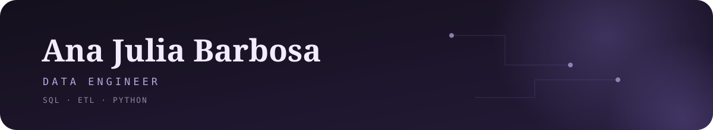

 

 

## Hi, I'm Ana

I'm a data engineer. I like the part of the job where messy data goes in and something people can actually use comes out: pipelines, SQL, ETL, dashboards.

I studied Systems Analysis and Development, so I come at data from the software side. I'm curious about how information moves through a system and what happens to it along the way. Lately I've also been playing with ways to bring AI into data workflows.

Right now I'm focused on growing as a data engineer and learning the modern tools and architectures around it.

 

## Tech Stack
 
**Languages** 

 
**Databases** 

 
**BI & reporting** 

 
**Learning next** 
 
 
 

## Projects

**[wnba-engineering](https://github.com/anabbarbosa/wnba-engineering)** 
A data engineering project that takes a real-world dataset through a full engineering workflow.

**[db-data-agents](https://github.com/anabbarbosa/db-data-agents)** 
An AI agent for PostgreSQL: ask questions about your database in natural language.

 

## GitHub stats

